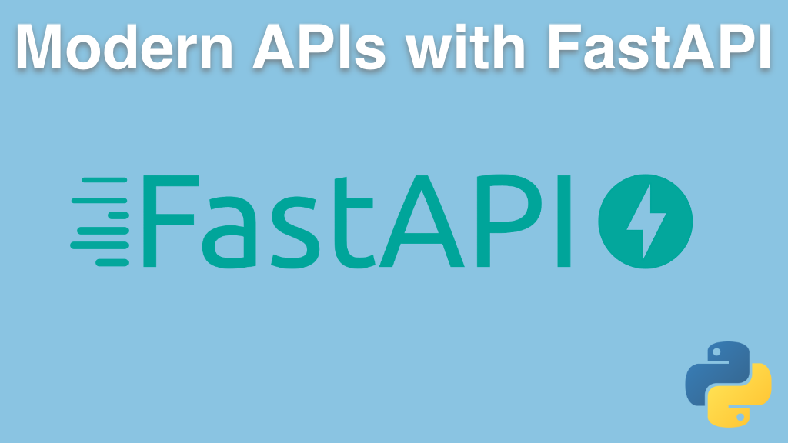

# Modern APIs with FastAPI course

Git: https://github.com/talkpython/modern-apis-with-fastapi
A course from Talk Python Training. Sign up at [**talkpython.fm/fastapi**](https://talkpython.fm/fastapi).

## Course Summary

FastAPI is one of the most exciting new web frameworks out today. It's exciting because it leverages more of the modern Python language features than any other framework: type hints, async and await, dataclasses, and much more. If you are building an API in Python, you have many choices. But, to us, FastAPI is the clear choice going forward. And this course will teach you everything you need to know to get started. We'll build a realistic API working with live data and deploy that API to a cloud server Linux VM. In fact, you'll even see how to create proper HTML web pages to augment your API all within FastAPI.

## What's this course about and how is it different?

This course is **designed to get you creating new APIs running in the cloud with FastAPIs quickly**. We start off with just a little foundational concepts, then jump right into build our first API with FastAPI.

Then we explore the foundational modern Python features to make sure you're ready to take full advantage of this framework. We'll look at how async and await works in Python, how to build self-validating and describing classes with Pydantic, Python 3's type hints, and other core language concepts.

We round out the course by building a realistic API working with live data. Then we deploy that API using nginx + gunicorn + uvicorn running on Ubuntu in a cloud VM at Digital Ocean.

## What topics are covered

In this course, you will:

- **See how simple working with basic APIs** in FastAPI can be.
- Create API methods that **handle common HTTP verbs** (GET, POST, DELETE, etc)
- **Return JSON data** to API clients
- **Use async and await** to create truly scalable applications
- **Leverage Pydantic** to create required and optional data exchange
- Have FastAPI **automatically validate and convert data types** (e.g. "2021-01-05" to a `datetime`)
- Organize your app using APIRoutes to **properly factor your application** across Python files.
- Return the **most appropriate error response** (e.g. 400 Bad Request) to API clients
- To deploy Python web applications in production-ready configurations on Linux
- Understand why gunicorn and uvicorn should be used together in production
- And lots more

View the [full course outline](https://training.talkpython.fm/courses/getting-started-with-fastapi).

## Who is this course for?

This course is for anyone who wants to build an API with Python as the backend language. If you want your API to rival the speed and features of any major web API framework, this is the course to take.

The **student requirements are quite light for this course**. You'll need Basic Python language knowledge:

- Functions
- Strings
- Variables
- API clients (making a call with requests)

Note: All software used during this course, including editors, Python language, etc., are 100% free and open source. **You won't have to buy anything to take the course**.

## Sound good?

If this sounds like a great course for you, take it over at [**talkpython.fm/fastapi**](https://talkpython.fm/fastapi).
